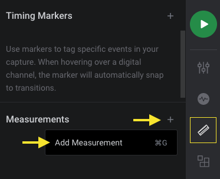

# Pulse Count

An extension that adds Pulse Count metrics to digital measurements.
- Np(+) is the number of positive pulses
- Np(-) is the number of negative pulses

## Instructions
1. Install this extension by clicking "Install"
2. Add a measurement by clicking on the "Annotations panel" on the right, then the Measurements "+" icon.

3. Drag the measurement selection window over your digital data.
